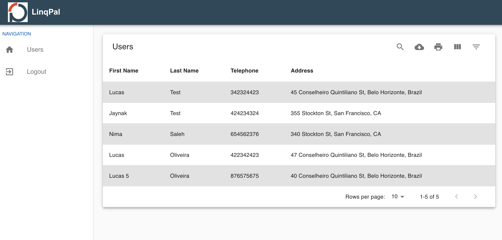

<h2 align="center"> 
    Test-Assignment to LinqPal 
</h2>

<h3 align="center"> Created with the stack  React,  Node and  MongoDB </h3>

## Screens

<p align="center">
    
    
    
</p>

# Step by step

Run the command to create the instances:

```
docker-compose up -d --build
``` 

List the containers for status and IDs

```
docker ps 
 ID    		     name 								status    		PORT
 f90520c99218        linqpal-mongodb          "docker-entrypoint.s…"   Up 25 minutes          Up 2 hours         0.0.0.0:27117->27017/tcp                     linqpal-mongodb
 f90520c99219        linqpal-backend          "docker-entrypoint.s…"   Up 25 minutes          Up 2 hours                                                      linqpal-backend
 f90520c99220        linqpal-frontend          "docker-entrypoint.s…"   Up 25 minutes          Up 2 hours                                                      linqpal-frontend
```   